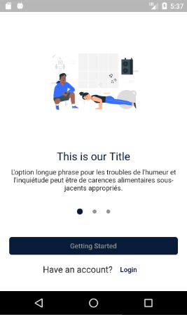
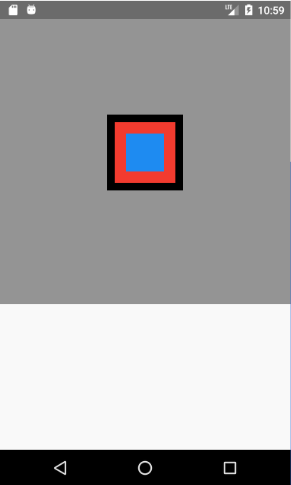
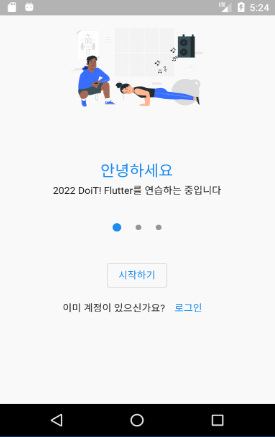
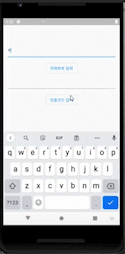
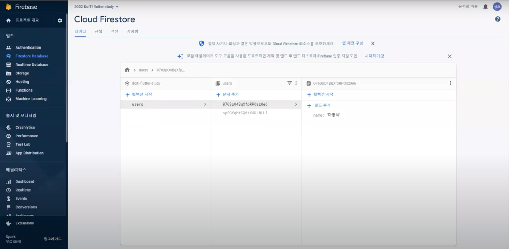
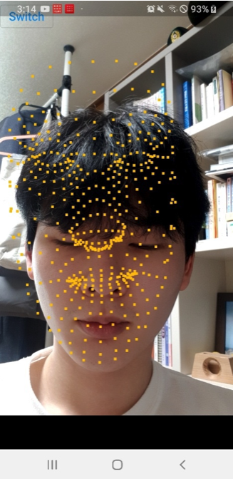

# DoiT! 2021년 동계방학 Flutter 스터디

## 팀원

+ 아주대학교 소프트웨어학과 18학번 장성호 (팀장)
+ 아주대학교 소프트웨어학과 19학번 홍성화
+ 아주대학교 미디어학과 19학번 서채민
+ 아주대학교 미어학과 20학번 이채민
+ 아주대학교 소프트웨어학과 21학번 정문영

## 목표

+ **Dart & Flutter 기초 이해**
+ **Flutter와 React Native 비교**
+ **Provider library 사용해보기**
+ **Flutter로 Snow 만들기**

Flutter를 사용해 프로그램을 만들기 위해서 알아야 할 기초적인 것을 공부하고자 합니다. 그리고 간단한 프로그램을 만들어보며 학습한 것을 활용해보고자 합니다.

## 진행 방식

+ 2022.01.19 ~ 2022.02.24 8주 동안 주당 2회 진행
+ "장성호 - 이채민 - 서채민 - 정문영 - 홍성화" 순서로 주차별 발표 주제에 대하여 발표
+ 발표자가 아니면 발표 주제에 대해서 공부한 것을 공유 드라이브에 업로드

## 진행 내용

### Flutter 기초 스터디

    
1주차

    <table>
      <thead>
        <th align="center">
         <strong>
              목표
         </strong>
        </th>
        <th align="center">
         <strong>
              기본 위젯 공부
         </strong>
        </th>
        <th align="center">
         <strong>
              목표 개발
         </strong>
        </th>
      </thead>
      <tbody>
        <tr>
          <td align="center">
            
          </td>
          <td align="center">
            
          </td>
          <td align="center">
            
          </td>
        </tr>
      </tbody>
    </table>
    

        Text, Container, Column, Row, Stack 등 기본 위젯을 공부한 뒤 목표 화면을 만들었습니다.
    

    
2주차

    <table>
      <thead>
        <th align="center">
         <strong>
              Splash Screen 만들기
         </strong>
        </th>
      </thead>
      <tbody>
        <tr>
          <td align="center">
            
          </td>
        </tr>
      </tbody>
    </table>
    

        Implicit animation과 Navigator를 통한 Routing을 학습했습니다.
    

    
3주차

    <table>
      <thead>
        <th align="center">
         <strong>
              Firebase 연동해서 전화번호 인증하기
         </strong>
        </th>
      </thead>
      <tbody>
        <tr>
          <td align="center">
            
          </td>
        </tr>
      </tbody>
    </table>
    

        Firebase 프로젝트를 설정하고 전화번호 인증을 통한 로그인을 구현했습니다.
    

    
4주차

    <table>
      <thead>
        <th align="center">
         <strong>
              Firebase 연동해서 데이터 저장하기
         </strong>
        </th>
      </thead>
      <tbody>
        <tr>
          <td align="center">
            
          </td>
        </tr>
      </tbody>
    </table>
    

        Flutter에서 Firestore를 연결한 뒤 데이터를 생성하거나 업데이트 하고, 삭제하는 등 CRUD를 진행해보았습니다.
    

### Flutter 간단한 프로젝트 진행

<table>
    <thead>
        <th align="center">
            <strong>
                오프라인 얼굴 분석 프로그램
            </strong>
        </th>
    </thead>
    <tbody>
        <tr>
          <td align="center">
            
          </td>
        </tr>
        <tr>
          <td align="center">
            <strong>
                Snow 같이 얼굴 위치를 따라다니는 필터를 만들어보고자 했습니다.
            </strong>
          </td>
        </tr>
        <tr>
          <td align="center">
            <strong>
                Mediapipe의 Facemesh 모델과 Tensorflow를 사용했습니다.
            </strong>
          </td>
        </tr>
    </tbody>
</table>

## 회고

Flutter를 사람들에게 소개할 수 있어 뜻깊은 시간이었습니다. React나 Spring 같은 프레임워크는 말하면 웬만한 사람이 알지만, Flutter는 아는 사람이 없어서 외로웠습니다...😂  그래도 같은 주제에 대해서 서로 다른 시각으로 바라보니, 독학 할 때보다 더 시야를 넓힐 수 있었습니다.

그리고 얼굴 분석 프로그램을 함께 만들어보면서 Dart의 Isolate와 Flutter의 MethodChannel, 그리고 ffi의 힘을 체감할 수 있었습니다. 프로젝트를 고도화하는 것이 아니라면 사용해보기조차 쉽지 않은 것들인데, 이번에 접할 수 있어서 굉장히 흥미로웠습니다.